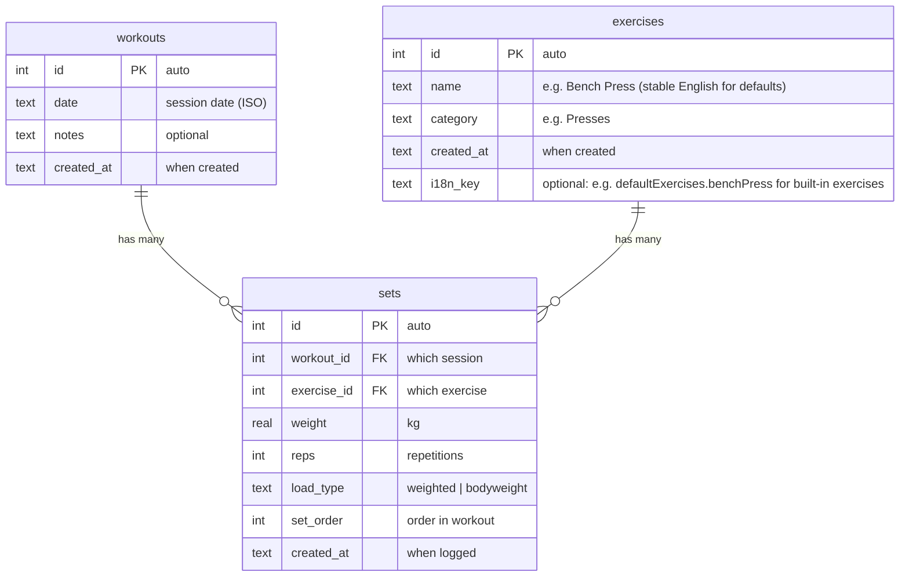

# LiftLog database structure

## Mermaid diagram: tables and relations



---

## Explained for beginners

### What each table is

| Table       | What it stores in plain English |
|------------|----------------------------------|
| **workouts** | One row = one training **session** (a day you trained). It only stores *when* (date) and optional notes. It does **not** store what you did; that’s in `sets`. |
| **exercises** | One row = one **exercise definition**: name + category (e.g. “Bench Press” in “Presses”). Built-in exercises have an optional **i18n_key** so the app can show a translated label when the language changes; custom exercises have no key and are shown by their stored **name**. |
| **sets**     | One row = **one performed set**: “I did X kg × Y reps of exercise Z in workout W.” So it links a **workout** (session) and an **exercise** (definition) and stores weight, reps, and type. |

### How they connect

- **workouts → sets:** One workout (one day) can have **many** sets. So: “Workout on 2025-02-18” has many rows in `sets`.
- **exercises → sets:** One exercise (e.g. “Bench Press”) can appear in **many** sets over time. So: “Bench Press” has many rows in `sets`, one per time you did it.
- **sets** is the “middle” table: each set belongs to **one** workout and **one** exercise.

So:

- **workouts** = “sessions” (when).
- **exercises** = “exercise catalog” (what movement).
- **sets** = “what I actually did” (which session + which exercise + weight/reps).

---

## Examples (step by step)

### 1. Exercises (your catalog)

You define exercises once; they are reused for every set you log.

| id | name         | category | i18n_key                    |
|----|--------------|----------|-----------------------------|
| 1  | Bench Press  | Presses  | defaultExercises.benchPress |
| 2  | Squat        | Legs     | defaultExercises.squats     |
| 3  | Deadlift     | Pulls    | defaultExercises.deadlift   |

(User-created exercises have `i18n_key` = NULL and are always shown by their **name**.)

So: “Bench Press” is **one** row in `exercises`. Every time you log a set of bench press, you use this same `exercise_id` (1).

---

### 2. Workouts (sessions by date)

Each row = one training day (one “workout” in the app).

| id | date       | notes   |
|----|------------|---------|
| 1  | 2025-02-18 |         |
| 2  | 2025-02-20 | Felt good |

So: “2025-02-18” is **one** workout. All sets you did that day will point to `workout_id = 1`.

---

### 3. Sets (what you did in each session)

Each row = one logged set: “In workout X, I did exercise Y with Z kg × N reps.”

| id | workout_id | exercise_id | weight | reps | load_type  |
|----|------------|-------------|--------|------|------------|
| 1  | 1          | 1           | 60     | 8    | weighted   |
| 2  | 1          | 2           | 100    | 5    | weighted   |
| 3  | 2          | 1           | 62     | 7    | weighted   |

Meaning:

- Set 1: In **workout 1** (2025-02-18), you did **exercise 1** (Bench Press): **60 kg × 8 reps**.
- Set 2: Same workout (2025-02-18), **exercise 2** (Squat): **100 kg × 5 reps**.
- Set 3: In **workout 2** (2025-02-20), **exercise 1** (Bench Press) again: **62 kg × 7 reps**.

So:

- One **workout** (one date) → many **sets**.
- One **exercise** (e.g. Bench Press) → many **sets** over different workouts.
- **sets** is the only table that stores **weight** and **reps**; workouts and exercises do not.

---

## Summary picture

```
workouts (sessions by date)
    │
    │  workout_id
    ▼
  sets  ◄──── exercise_id
    │              │
    │              ▼
    │         exercises (name + category)
    │
    └── Each set: "In this workout, I did this exercise with this weight × reps."
```

- **workouts** = when (date + optional notes).
- **exercises** = what movement (name + category), defined once.
- **sets** = the actual log: which workout + which exercise + weight, reps, load_type, order.

That’s the whole structure: three tables and these two relations (workouts → sets, exercises → sets).

---

## Default exercise translation (i18n)

- **Built-in (default) exercises** are seeded with an English **name** and an **i18n_key** (e.g. `defaultExercises.benchPress`). The UI shows the translated label for the current language using this key; the stored `name` stays English for consistency and for export/backfill.
- **User-created exercises** have no `i18n_key`; the UI always shows their stored **name**.
- **Migration:** On first run after adding `i18n_key`, existing exercises whose `name` matches any built-in name (in any supported locale) get their `i18n_key` backfilled so they start showing translated names.
- **Display:** Anywhere we show an exercise name, we use: if `i18n_key` is set → show `t(i18n_key)`; else → show `name`. Helpers: `getExerciseDisplayName(name, i18nKey, t)` and, when the identifier is a "stable id" (i18n key or custom name), `getExerciseDisplayNameForStableId(stableId, t)`.
- **Categories:** Default section names (PULLS, PRESSES, LEGS) are translated in the UI via `getCategoryDisplayName(category, t)` (no DB column); custom section names are shown as stored.
